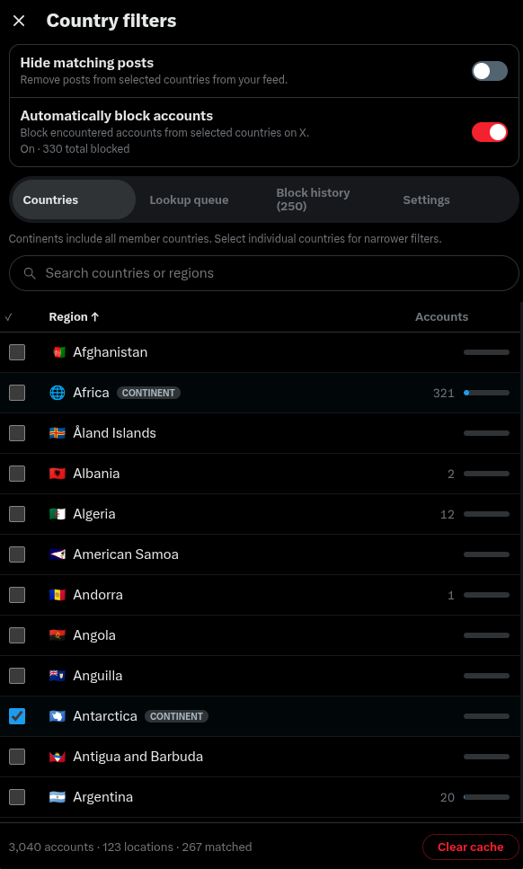

# LocaleFence

LocaleFence is a userscript for hiding posts and automatically blocking X accounts based on the location shown in X's **About this account** data.

> Automatic blocking creates real blocks on your X account and remains enabled across reloads until you turn it off. Review your selected locations before enabling it.

**[Install LocaleFence](https://raw.githubusercontent.com/ssupt/LocaleFence/main/localefence.user.js)**

<p align="center">
  
</p>

## Features

- Select individual countries, X regions, or whole continents.
- Hide matching posts without blocking their authors.
- Automatically block matching accounts as their posts appear in the feed.
- Show the account, flag, and triggering post in each block notification.
- Enable or disable notifications from the Settings tab. They are enabled by default.
- Exclude and immediately unblock an account from its notification or block-history entry.
- Keep a persistent queue when X temporarily cannot resolve an account location.
- Keep a local history of confirmed automatic blocks and their triggering posts.
- Cache successful location lookups for 28 days to reduce requests and rate limits.

## Install

1. Install a userscript manager such as Tampermonkey or Violentmonkey.
2. Open **[Install LocaleFence](https://raw.githubusercontent.com/ssupt/LocaleFence/main/localefence.user.js)** and confirm the installation.
3. Open or reload [x.com](https://x.com/).

LocaleFence adds a **LocaleFence** item to X's navigation.

## Use

1. Open **LocaleFence** and select the locations you want to match.
2. Enable **Hide matching posts**, **Automatically block accounts**, or both.
3. Use **Lookup queue** to inspect unresolved or failed location checks.
4. Use **Block history** to review confirmed blocks and open their triggering posts.
5. Use **Settings** to disable or re-enable notifications.

Automatic blocking remains enabled across X reloads until you turn it off. Changing selected locations changes which accounts match while it is enabled.

Selecting a continent includes all of its member countries. You can also select individual countries independently. Continent membership follows the [UN M49 geographic classification](https://unstats.un.org/unsd/methodology/m49/overview/).

When X rate-limits a location lookup, LocaleFence retains the account and post snapshot, retries with backoff, and exposes the pending item in the lookup queue. A non-matching account leaves the queue after resolution. A matching account remains until X confirms the block, then moves to block history.

## Data and privacy

LocaleFence runs entirely in the browser. It does not use an external server or send account data outside `x.com`.

It stores the following data locally:

- Selected locations, settings, exclusions, and the lifetime block count in `localStorage`.
- Resolved account IDs, names, locations, and cache timestamps in IndexedDB.
- Pending lookup records and up to 250 confirmed block-history entries in IndexedDB.

The **Clear cache**, **Clear queue**, and **Clear history** controls remove those respective datasets. Clearing history does not reset the lifetime block counter or undo X blocks.

## Limitations

- Locations come from X's account metadata and may be missing or inaccurate.
- X's private web APIs can change without notice and temporarily break lookups or blocking.
- Rate limits can delay decisions; unresolved accounts remain visible in the lookup queue.
- Excluding an account requires a successful unblock request to undo an existing block.

## Development

The project intentionally stays as a single dependency-free userscript. Run a syntax check before publishing:

```sh
node --check localefence.user.js
```

## License

[GNU General Public License v3.0 only](LICENSE). This software is provided without warranty.
